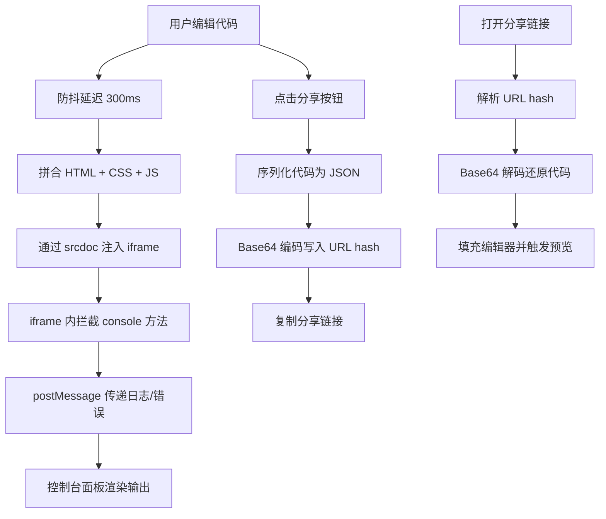

## 1. 产品概述

前端代码沙箱运行器，类似 CodePen 的在线代码编辑与实时预览工具。用户可以在三个独立编辑区分别编写 HTML、CSS 和 JavaScript 代码，底部 iframe 实时渲染预览效果。支持 JavaScript 错误捕获与 console 输出展示，并可将代码状态编码为 URL hash 实现分享。

- 面向前端开发者和学习者，提供轻量级、即开即用的代码实验环境
- 核心价值：零配置、实时反馈、一键分享

## 2. 核心功能

### 2.1 功能模块

1. **编辑区页面**：HTML/CSS/JavaScript 三栏编辑器、实时预览 iframe、控制台面板、分享功能

### 2.2 页面详情

| 页面名称 | 模块名称 | 功能描述 |
|----------|----------|----------|
| 编辑区页面 | HTML 编辑器 | 支持 HTML 代码输入，语法高亮，代码变更实时触发预览更新 |
| 编辑区页面 | CSS 编辑器 | 支持 CSS 代码输入，语法高亮，代码变更实时触发预览更新 |
| 编辑区页面 | JavaScript 编辑器 | 支持 JavaScript 代码输入，语法高亮，代码变更实时触发预览更新 |
| 编辑区页面 | 实时预览 iframe | 使用 srcdoc 属性注入拼接后的代码，避免 URL 导航问题 |
| 编辑区页面 | 控制台面板 | 捕获 JavaScript 运行时错误并显示；展示 console.log 等输出；对象类型输出支持折叠/展开查看属性 |
| 编辑区页面 | 分享功能 | 将当前三段代码编码为 URL hash，生成分享链接；打开分享链接时自动加载对应代码 |

## 3. 核心流程

用户在编辑区输入代码 → 防抖延迟后拼合 HTML/CSS/JS → 通过 srcdoc 注入 iframe → iframe 内重写 console 方法捕获输出 → 通过 postMessage 将日志和错误传递给父页面 → 控制台面板展示输出（对象可折叠展开）。用户点击分享按钮 → 将代码序列化并编码为 URL hash → 复制链接到剪贴板。他人打开链接 → 从 URL hash 解码并填充编辑器 → 自动触发首次预览。

## 4. 用户界面设计

### 4.1 设计风格

- 主色调：深色主题，编辑器背景 #1e1e2e，预览区白色
- 强调色：HTML 橙红 #e44d26、CSS 蓝色 #264de4、JavaScript 黄色 #f7df1e
- 字体：代码区使用 JetBrains Mono，UI 文本使用 Outfit
- 布局：三栏水平编辑区 + 下方预览区，可调整分区大小
- 图标：简洁线性图标风格

### 4.2 页面设计概览

| 页面名称 | 模块名称 | UI 元素 |
|----------|----------|---------|
| 编辑区页面 | 编辑器区域 | 三个水平排列的代码编辑面板，每个带语言标签和图标，深色背景 + 彩色标签头 |
| 编辑区页面 | 预览区域 | 白色背景 iframe，占据下方约 40% 空间，带刷新按钮 |
| 编辑区页面 | 控制台面板 | 可折叠的底部面板，带标签页（控制台/错误），日志条目带颜色区分，对象可展开箭头 |
| 编辑区页面 | 工具栏 | 顶部工具栏含分享按钮、重置按钮，居中显示项目名称 |

### 4.3 响应式

- 桌面优先设计，三栏水平编辑区
- 平板端编辑区改为可切换标签页
- 移动端全标签页模式，预览区全屏切换
