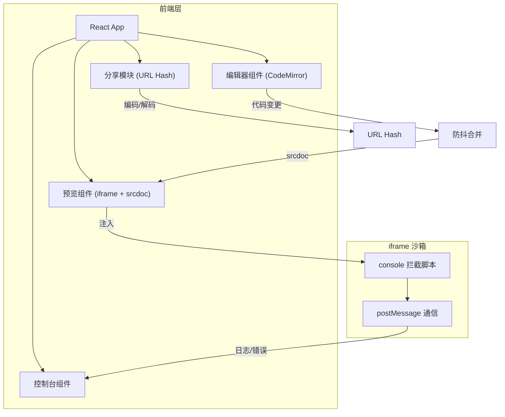

## 1. 架构设计



## 2. 技术说明

- 前端：React@18 + Tailwind CSS@3 + Vite
- 初始化工具：Vite
- 代码编辑器：CodeMirror 6（@codemirror/view, @codemirror/state, @codemirror/lang-html, @codemirror/lang-css, @codemirror/lang-javascript）
- 后端：无
- 数据库：无（状态全部存储在 URL hash 和组件 state 中）

## 3. 路由定义

| 路由 | 用途 |
|------|------|
| / | 主编辑区页面，包含编辑器、预览和控制台 |

## 4. 核心技术方案

### 4.1 iframe 预览

使用 `srcdoc` 属性将拼接后的 HTML/CSS/JS 注入 iframe，避免 URL 导航。每次代码变更后重新设置 srcdoc 触发渲染。iframe 设置 `sandbox="allow-scripts"` 安全属性。

### 4.2 Console 拦截

在注入 iframe 的 HTML 中嵌入一段拦截脚本，重写 `console.log`、`console.warn`、`console.error`、`console.info` 方法，将参数序列化后通过 `window.parent.postMessage` 传递给父页面。对象类型参数递归遍历序列化为可展示的树形结构。

### 4.3 错误捕获

在 iframe 内通过 `window.onerror` 和 `window.addEventListener('unhandledrejection')` 捕获运行时错误，同样通过 postMessage 传递给父页面。

### 4.4 URL Hash 分享

- 编码：将 HTML/CSS/JS 代码序列化为 JSON → 使用 LZString 压缩 → Base64 编码 → 写入 URL hash
- 解码：从 URL hash 读取 → Base64 解码 → LZString 解压 → JSON 反序列化 → 填充编辑器
- 使用 lz-string 库（lz-string）进行压缩以减小 URL 长度

### 4.5 控制台面板

- 日志条目按类型（log/warn/error/info）使用不同颜色和图标标识
- 对象类型输出支持折叠/展开，使用递归组件渲染属性树
- 错误条目显示错误堆栈信息
- 支持清空控制台

## 5. 组件结构

```
App
├── Toolbar（工具栏：分享、重置）
├── EditorPanel（编辑区容器）
│   ├── CodeEditor（HTML）
│   ├── CodeEditor（CSS）
│   └── CodeEditor（JavaScript）
├── PreviewPanel（预览区）
│   └── iframe（srcdoc）
└── ConsolePanel（控制台）
    ├── ConsoleEntry（日志条目）
    └── ObjectTree（可折叠对象树）
```
